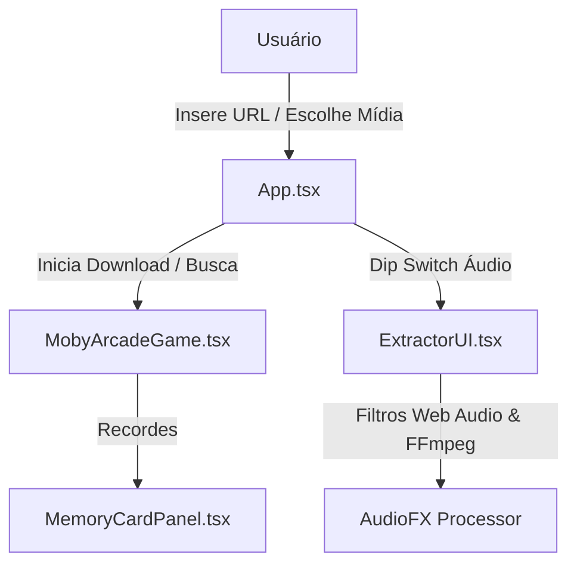

# Plano de Implementação — Features Retrô Y2K mobyP3 (Arcade Mini-Game & Audio FX Synthesizer)

> **Objetivo:** Transformar o mobyP3 em uma experiência retrô completa integrando um **Mini-Game Arcade 8-bit** para entreter durante os downloads e um **Sintetizador de Efeitos de Áudio Retrô** (Chiptune, Nightcore, Rádio 90s, Bass Boost).

---

## 📅 Visão Geral da Arquitetura & Componentes

---

## 🧩 Componentes a Criar & Modificar

### 1. [NEW] `frontend/src/components/MobyArcadeGame.tsx`
- **Mini-Game Canvas 8-bit**:
  - Moby a baleia voadora em arte 8-bit pulando sobre obstáculos (disquetes, fitas K7, ondas sonoras).
  - Controles responsivos: Toque no celular ou tecla Espaço no teclado.
  - Pontuação em tempo real com contador estilo contador de fichas de arcade.
  - Salva o recorde (*HIGH SCORE*) diretamente no **Memory Card 8MB**.
  - Disparado automaticamente durante o processamento do download ou no botão manual `[ 🎮 JOGAR ARCADE ]`.

### 2. [MODIFY] `frontend/src/components/ExtractorUI.tsx`
- **Efeitos de Áudio Retrô (Dip Switch)**:
  - Adicionar seletor de efeitos de som na aba **ÁUDIO**:
    - 🎵 **Normal / Padrão**
    - 🕹️ **Chiptune 8-Bit** (Som de Game Boy / NES)
    - ⚡ **Nightcore / Speed Up** (1.25x velocidade + pitch elevado)
    - 📻 **Rádio FM 90s** (Filtro AM/FM vintage)
    - 💥 **Bass Boost Retrô** (Graves reforçados)
  - Integração com a requisição `/api/process` enviando o parâmetro `audio_fx`.

### 3. [MODIFY] `backend/main.py`
- **Suporte a Audio FX via FFmpeg**:
  - Aceitar parâmetro `audio_fx` na rota `/api/process`.
  - Aplicar filtros `af` do FFmpeg conforme a opção escolhida:
    - Chiptune: `'aresample=8000,asetrate=8000*1.2,lowpass=f=3000'`
    - Nightcore: `'asetrate=44100*1.25,atempo=1.0'`
    - Rádio 90s: `'highpass=f=300,lowpass=f=3000'`
    - Bass Boost: `'equalizer=f=60:width_type=h:width=50:g=10'`

### 4. [MODIFY] `frontend/src/App.tsx`
- Integração do modal / painel do `MobyArcadeGame`.
- Atualização do status do Memory Card para registrar a maior pontuação no Arcade.

---

## 🧪 Plano de Verificação

### Testes Automatizados & Validação
1. Compilação TypeScript e Bundling Vite (`npm run build`).
2. Teste da API FastAPI no endpoint `/api/process` com os parâmetros `audio_fx`.

### Teste Manual de UX/UI
1. Abrir o jogo Arcade durante a extração de um vídeo e verificar a fluidez a 60 FPS e touch targets.
2. Baixar uma música em MP3 com o efeito **Chiptune 8-Bit** e verificar a conversão no arquivo final.
